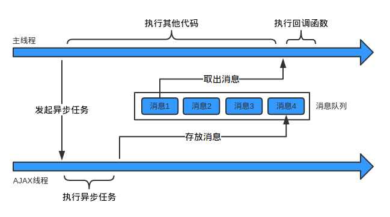

# 单线程的JS
众所周知，JS是单线程的。

所谓单线程，是指，解释和执行JS代码的线程，只有一个，一般称之为“主线程”。

然而JS中实际上还有一些其他线程，比如处理网络请求的线程，处理IO的线程，处理网页事件的线程等等。我们可以统称之为“工作线程”

为了不让一些动作缓慢的任务，阻塞“主线程”，设计者给JS加了一个事件循环（Event Loop）的机制。

# 事件循环
我们知道，JS的异步机制，是通过事件循环来实现的。

简单来说，在JS中，有一个消息队列。

主线程代码执行过程中，会触发一系列的异步任务源。

这些任务源，会在工作线程中执行任务，执行完各自的任务后，把一个个的消息（回调），放进消息队列，后续主线程会遵从先进先出的原则，一个个执行这些消息（回调）。

因而，主线程不断的查看消息队列，如果有消息，就执行，没有就继续等待，这样的一个过程，就叫事件循环。其中一个消息的执行，叫做一次循环。

图示：


# 任务源
消息队列里的每一个消息（任务），都对应了一个任务源，JS里的任务源很多，以下这些，都是任务源：
- 定时器
- UI Render
- I/O

# “宏”任务，“微”任务
看一下这段代码：
```javascript
console.log('1')

setTimeout( function () {
  console.log('2')
}, 0 )

Promise.resolve().then(function() {
  console.log('3');
}).then(function() {
  console.log('4');
});

console.log('5')

// 输出顺序：1，5，3，4，2
```

在JS中的任务，实际上分为2种：

一种为“Task”，或者叫“宏任务”；

一种为“MicroTask”，或者叫“Job”，翻译过来可以叫“微任务”。

对于第二种任务，即，微任务，也有一种专门的队列用于存放，暂且叫“微任务队列”。

不同于一般的任务队列（宏任务队列），这种“微任务队列”，是属于每一个宏任务的。

也就是说，每一个宏任务之中，都可能包含一个“微任务队列”

下面列一下对于两种不同的任务，对应的不同任务源：

- 宏任务源: 
  - 整体代码
  - setTimeout
  - setInterval
  - setImmediate
  - requestAnimationFrame,
  - I/O
  - UI rendering
- 微任务源: 
    - process.nextTick
    - Promises
    - Object.observe
    - MutationObserver

打个比方来说，“宏任务队列”如果是一列火车，那么每个“宏任务”就相当于一节车厢，“微任务队列”就相当于每节车厢的最后一排座位，其中每个座位，就是一个“微任务”。

所以现在我们来分析一下上方这段代码：

1. 执行到1处，输出1
2. 执行到2处，这是一个定时器，宏任务源，加入宏任务队列
3. 执行到3处，这是一个promise，微任务源，加入微任务队列
4. 执行到4处，同上
5. 执行到5处，输出5
6. 由于整体代码是一个宏任务，执行完后，开始执行该宏任务之内，被添加到微任务队列的微任务，所以顺序输出3，4
7. 微任务执行完毕，开始下一个宏任务，即定时器回调，输出2

以上。